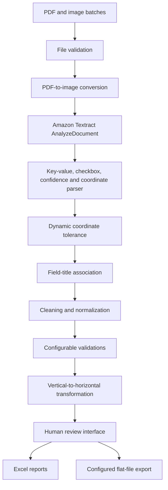

# Architecture

## Main layers

### Document input

The workflow accepts PDF and common image formats. PDF pages are converted into images before analysis.

### Extraction

Amazon Textract `AnalyzeDocument` with the `FORMS` feature identifies keys, values and selection elements. The parser retains confidence scores and spatial coordinates.

### Spatial association

Reference coordinates and detected anchor fields are used to estimate document displacement. A dynamic tolerance is then applied when associating extracted values with configured output fields.

### Data quality

Cleaning functions normalize dates, adjacent words, phone numbers, locations and other recurring field patterns. Validation rules use configurable lists rather than hard-coded values where practical.

### Human review and export

A desktop interface allows users to inspect and correct structured records before generating Excel reports and a downstream flat file.

## Public reconstruction

The public repository will expose generic architecture and reusable examples only. Customer-specific field definitions, master lists and output layouts remain private.
